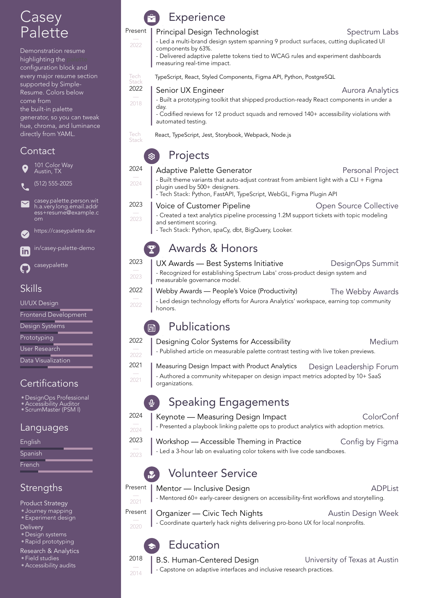

_A CLI tool for generating resumes from YAML files._

[](
  https://github.com/athola/simple-resume/actions/workflows/CI.yml
)
[](
  https://codecov.io/gh/athola/simple-resume
)
[](
  https://github.com/athola/simple-resume/blob/main/LICENSE
)
[](
  https://pypi.org/project/simple-resume/
)
[](
  https://github.com/athola/simple-resume/issues?q=is%3Aopen+is%3Aissue+label%3Abug
)
[](
  https://github.com/athola/simple-resume/pulls
)

# Simple-Resume

This tool generates PDF, HTML, and LaTeX resumes from a single YAML source file. This approach allows version-controllable resume content, with different templates and color schemes. Use it as a command-line utility or Python library.

## Getting Started

### Installation

```bash
# Install with uv (recommended)
uv add simple-resume

# Install with pip
pip install simple-resume
```

### Development Setup

```bash
git clone https://github.com/athola/simple-resume.git
cd simple-resume

# Development install with uv
uv sync --dev --extra utils

# Development install with pip
pip install -e .
```

## Quick Start

### 1. Create Your Resume

Create a YAML file with resume content. The `template` field specifies the base template.

```yaml
# resume_private/input/my_resume.yaml
template: resume_base

full_name: Jane Doe
job_title: Software Engineer

address:
  - 123 Tech Street
  - San Francisco, CA

phone: "(555) 123-4567"
email: jane.doe@example.com
web: https://jandoe.dev
linkedin: in/janedoe
github: janedoe

description: |
  Software engineer with 5+ years of experience building scalable
  web applications and leading cross-functional teams.

body:
  experience:
    - title: Senior Software Engineer
      company: TechCorp
      start: 2022
      end: Present
      description: |
        * Led development of microservices architecture serving 1M+ users
        * Mentored junior developers and conducted code reviews
        * Improved system performance by 40% through optimization

  skills:
    - Python
    - JavaScript
    - React
    - Node.js
    - PostgreSQL
    - Docker
    - AWS
```

### 2. Generate Resume

Use `simple-resume generate` to create resumes in different formats.

```bash
# Generate a PDF
uv run simple-resume generate --format pdf

# Generate an HTML file
uv run simple-resume generate --format html

# Generate a PDF and open it
uv run simple-resume generate --format pdf --open
```

### 3. Use the Python API

The tool can also be used as a library.

```python
from simple_resume import generate, preview
from simple_resume.generation import GenerateOptions

# Generate PDF and HTML files
results = generate(
    "resume_private/input/my_resume.yaml", GenerateOptions(formats=("pdf", "html"))
)

# Preview the resume (opens in a web browser)
preview("resume_private/input/my_resume.yaml", open_after=True)
```

### 4. Custom Styling

Apply a color palette by name or custom palette file path.

```bash
# Use a built-in palette
uv run simple-resume generate --palette "Professional Blue"

# Use a custom palette file
uv run simple-resume generate --palette resume_private/palettes/my-theme.yaml
```

### 5. API Utilities

The API includes helper functions, for example, to calculate text color based on background.

```python
from simple_resume.api import colors

accent = colors.calculate_text_color("#F6F6F6")
assert accent == "#000000"
```

## Documentation

- **[Getting Started](wiki/Getting-Started.md)**
- **[Usage Guide](wiki/Usage-Guide.md)**
- **[Development Guide](wiki/Development-Guide.md)**
- **[API Reference](docs/reference.md)**

## Getting Help

For bugs and feature requests, open a GitHub issue. For questions, use GitHub Discussions.

- **[GitHub Issues](https://github.com/athola/simple-resume/issues)**
- **[GitHub Discussions](https://github.com/athola/simple-resume/discussions)**

See `sample/` for more example resume files.

## Contributing

1. Fork repository and create feature branch.
2. Set up environment by following the [Development Guide](wiki/Development-Guide.md).
3. Make changes and add tests.
4. Run `make check-all` to run all checks.
5. Submit a pull request.

## License

This project is licensed under the MIT License.
