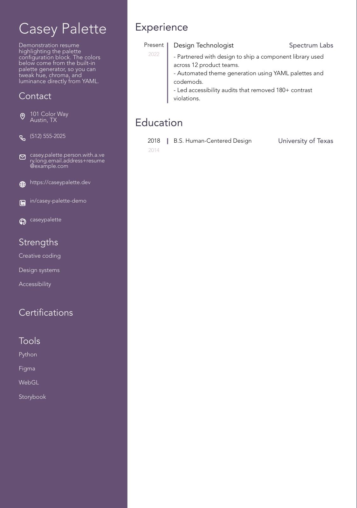

# EasyResume

Turn structured YAML into print-ready resumes using Python and WeasyPrint.



The full sample PDF lives in `assets/sample.pdf`.

## Highlights

- Generate PDFs from templated HTML with a single command.
- Use Markdown inside YAML entries for rich formatting (bold, links, tables, code blocks).
- Includes CI workflows for type checking, linting, and security scans.

## Documentation

All project guides are stored in the repo [wiki](wiki/) (mirroring the GitHub wiki):

- `wiki/Markdown-Guide.md` – author Markdown-rich Resume content.
- `wiki/Color-Schemes.md` – customize colors with preset themes or create your own.
- `wiki/Workflows.md` – understand the CI/CD pipeline and quality gates.

## Installation

We use [uv](https://github.com/astral-sh/uv) for dependency management.

```bash
# Install dependencies
uv sync

# (Optional) install tooling extras
uv sync --group utils
```

You also need a local copy of [wkhtmltopdf](https://wkhtmltopdf.org/).

## Quick Start

1. Copy `sample/input/sample_1.yaml` into your data directory and replace the
   placeholder content with your own information.
2. Customize colors by editing the `config` section in your YAML file (see
   `wiki/Color-Schemes.md` for preset themes).
3. Generate HTML resumes: `uv run python src/easyresume/generate_html.py`.
   - **⚠️ Subprocess Warning**: The `--open` flag triggers subprocess calls to launch external browsers
4. Generate PDFs for every YAML file:
   `uv run python src/easyresume/generate_pdf.py`.
   - **⚠️ Subprocess Warning**: The `--open` flag triggers subprocess calls to launch system PDF viewers

## Command Line Interface

### generate-pdf

```bash
generate-pdf [--data-dir PATH] [--open]
```

**Flags:**

- `--data-dir PATH`: Specify custom input/output directory locations
- `--open`: ⚠️ **TRIGGERS SUBPROCESS** - Opens each generated PDF with system viewer
  - macOS: Launches PDF viewer via `open` command
  - Linux: Launches PDF viewer via `xdg-open` command
  - Windows: Uses system file association via `start`

### generate-html

```bash
generate-html [--data-dir PATH] [--open] [--browser BROWSER]
```

**Flags:**

- `--data-dir PATH`: Specify custom input/output directory locations
- `--open`: ⚠️ **TRIGGERS SUBPROCESS** - Opens each HTML file in default browser
  - Detects and prefers Firefox, with Chromium as a secondary option
  - Uses subprocess to launch external browser process
- `--browser BROWSER`: Specify explicit browser command (e.g., "firefox", "chromium")
  - Note: This option triggers subprocess only when used with `--open`

Configuration values (input/output locations, URLs) live in `src/easyresume/config.py`.

## Development

- `make install` – install dependencies (including tooling extras).
- `make test` – run the full pytest suite.
- `make lint` / `make format` – lint and format with Ruff.
- `make typecheck` – run mypy and ty.
- `make generate-pdf` – create PDFs using the configured data directory.
  - For HTML output, run `uv run generate-html`.

### CI workflows

This repository ships reusable GitHub Actions workflows for linting, testing,
security, documentation, and publishing. To enable automatic wiki syncing, add a
`WIKI_TOKEN` repository secret with access to the project wiki; the
`wiki-sync.yml` workflow will mirror files under `wiki/` to the GitHub wiki on
pushes to `main`.

See `wiki/Workflows.md` for the full CI matrix and quality gates.

## Contributing

Issues and pull requests are welcome. Please review the wiki guidelines and
ensure all tests and linters pass before opening a PR.

## License

This project is released under the [MIT License](https://opensource.org/licenses/MIT).
