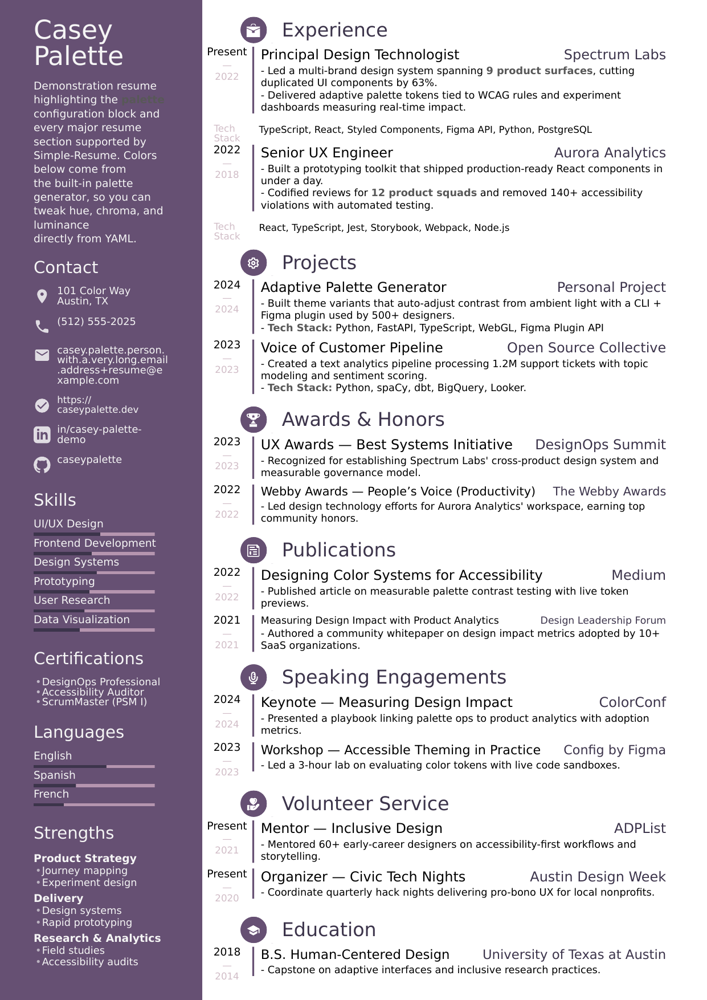

_Generate polished PDF and HTML resumes from a single YAML file._

[](https://github.com/athola/simple-resume/actions/workflows/code-quality.yml)
[](https://github.com/athola/simple-resume/actions/workflows/lint.yml)
[](https://github.com/athola/simple-resume/actions/workflows/test.yml)
[](https://codecov.io/gh/athola/simple-resume)
[](https://pypi.org/project/simple-resume/)
[](LICENSE)

# simple-resume

`simple-resume` is a Python 3.10+ CLI and library for converting structured YAML into production-ready resumes (PDF, HTML, or LaTeX). Templates and static assets ship with the package such that users can render without needing to create additional content.

## Why Simple-Resume

- Keep your resume version-controlled as plain YAML.
- Swap templates, palettes, and formats without rewriting content.
- Pure-Python core with shell adapters; effects are testable and side-effect aware.
- Bundled HTML templates and static assets prevent “TemplateNotFound” errors in wheels/editable installs.

## Supported platforms

- Python: 3.10+ (tested in CI)
- OS: Linux, macOS, Windows. PDF output uses WeasyPrint; ensure Cairo/Pango/GTK are available on your platform (see [Usage Guide](wiki/Usage-Guide.md#system-dependencies)).

## Installation

```bash
# With uv (recommended)
uv add simple-resume

# With pip
pip install simple-resume
```

### Development setup

```bash
git clone https://github.com/athola/simple-resume.git
cd simple-resume
uv sync --dev --extra utils   # or: pip install -e .[dev,utils]
```

## Quick start (CLI)

Create a minimal YAML in `resume_private/input/my_resume.yaml`:

```yaml
template: resume_no_bars
full_name: Jane Doe
email: jane.doe@example.com
body:
  Experience:
    - title: Senior Engineer
      company: TechCorp
      start: 2022
      end: Present
      description: |
        - Lead microservices migration
        - Improved latency by 40%
```

Generate output:

```bash
uv run simple-resume generate --format pdf         # PDF
uv run simple-resume generate --format html --open # HTML + open in browser
```

Built-in templates: `resume_no_bars`, `resume_with_bars`, `demo.html` (see `src/simple_resume/shell/assets/templates/html/`). Static assets live under `.../assets/static/`.

## Python API

```python
from simple_resume import generate, preview
from simple_resume.shell.generate import GenerateOptions

options = GenerateOptions(formats=["pdf", "html"], template="resume_with_bars")
results = generate("resume_private/input/my_resume.yaml", options)
print(results["pdf"].output_path)

# Browser preview
preview("resume_private/input/my_resume.yaml")
```

For batch operations:

```python
from simple_resume.shell.session import ResumeSession

with ResumeSession(data_dir="resume_private") as session:
    session.generate_all(format="pdf")
```

## Customization

- **Palettes**: `--palette "Professional Blue"` or `--palette path/to/palette.yaml`.
- **Custom templates**: `--template custom.html` with `--templates-dir /path/to/templates`.
- **LaTeX**: set `config.output_mode: latex` and compile with your TeX toolchain (see [Usage Guide](wiki/Usage-Guide.md#latex-output)).
- **Color utilities**: `simple_resume.core.colors.get_contrasting_text_color` for accessibility checks.

## Workflows & docs

- **Guides**: [Getting Started](wiki/Getting-Started.md), [Usage](wiki/Usage-Guide.md), [Workflows](wiki/Workflows.md), [Path Handling](wiki/Path-Handling-Guide.md).
- **Architecture**: [Architecture Guide](wiki/Architecture-Guide.md) and `wiki/architecture/`.
- **Migration**: [Migration Guide](wiki/Migration-Guide.md) plus [Generate module migration](wiki/Migration-Guide-Generate-Module.md).
- **Development**: [Development Guide](wiki/Development-Guide.md), [Contributing](wiki/Contributing.md), [PDF renderer evaluation](wiki/PDF-Renderer-Evaluation.md).
- **Samples**: `sample/` directory; `sample_dark_sidebar.html` preview.

## Troubleshooting

- `TemplateNotFound`: confirm installation includes packaged assets (bundled in wheels/editable installs); custom templates require `--templates-dir`.
- PDF on Linux: install system libs `cairo`, `pango`, `gdk-pixbuf` (WeasyPrint requirement).

## Contributing

1. Follow the [Development Guide](wiki/Development-Guide.md) to set up tools.
2. Run `make lint` and `make test` (or `make check-all validate`) before opening a PR.
3. Submit issues or ideas in [GitHub Issues](https://github.com/athola/simple-resume/issues) or discussions.

## License

MIT License. See [LICENSE](LICENSE).

## Star history

[](https://www.star-history.com/#athola/simple-resume&type=date&legend=top-left)
