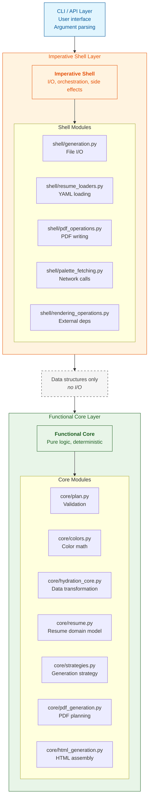

# Architecture Guide: Functional Core, Imperative Shell

**Status:** In Progress (65% adherence, target 90%+)
**Last Updated:** 2025-11-14
**Related:** [ADR002](architecture/ADR002-functional-core-imperative-shell.md), [Refactoring Plan](../CORE_REFACTOR_PLAN.md)

## Overview

simple-resume uses a **Functional Core, Imperative Shell** pattern. This architecture separates pure, testable business logic from I/O and other side effects. The separation means the core can be tested quickly and deterministically without mocks, while the shell handles interactions with the outside world (e.g., file system, network).

The "core" contains deterministic functions that are tested in memory without mocks, which makes the core test suite very fast. The "shell" manages all I/O, configuration, and orchestration of calls to the core.

## Architecture Layers



## Import Rules

The architecture is enforced by strict import rules that prevent the core from depending on the shell or any I/O libraries.

### ALLOWED

| From Layer | To Layer | Justification |
|------------|----------|---------------|
| Shell → Core | Allowed | The shell orchestrates business logic by calling core functions. |
| Shell → External libs | Allowed | The shell is the only layer that should depend on I/O libraries. |
| Core → Core | Allowed | Core modules can be composed to build up complex logic. |
| CLI → Shell | Allowed | The CLI acts as the entry point, delegating tasks to the shell. |
| CLI → Core | Allowed | The CLI may use data models and types defined in the core. |

### FORBIDDEN

| From Layer | To Layer | Justification |
|------------|----------|---------------|
| Core → Shell | Forbidden | This would violate the separation of concerns and create circular dependencies. |
| Core → I/O libs | Forbidden | This would make the core impure and difficult to test without mocking. |
| Core → Network | Forbidden | All side effects, including network calls, belong in the shell. |
| Core → Filesystem | Forbidden | All side effects, including file operations, belong in the shell. |
| Core → subprocess | Forbidden | All side effects, including external process calls, belong in the shell. |

### Forbidden I/O Libraries in Core

Core modules **must not** import libraries that perform I/O. An automated test suite fails any commit that adds a prohibited import to the core, ensuring the boundary is maintained. Prohibited libraries include:
- `weasyprint`
- `yaml`
- `requests` / `urllib`
- `subprocess`
- `open()`

### Dependency Injection

The core can accept callables or protocols that perform I/O, but it cannot be responsible for creating them. The shell provides the concrete implementations.

```python
# Correct: Core accepts an injected dependency.
def hydrate_resume_structure(
    source_yaml: dict[str, Any],
    *,
    render_markdown_fn: Callable[[dict], dict],  # Injected from the shell
) -> dict[str, Any]:
    return render_markdown_fn(source_yaml)

# Incorrect: Core imports and calls an I/O function directly.
from ..utils.io import read_yaml_file

def hydrate_resume_structure(filename: str) -> dict[str, Any]:
    # This is a violation because the core is performing I/O.
    data = read_yaml_file(filename)
    ...
```

## Design Patterns

We use the following patterns to keep the core and shell separate.

### 1. Pure Functions in the Core

Core functions must be deterministic: for a given input, they always produce the same output. They do not have side effects.

**Example:**

```python
# core/colors.py - A pure function for color calculation.
def calculate_contrast_ratio(color1: str, color2: str) -> float:
    """Calculate WCAG contrast ratio between two colors."""
    rgb1 = hex_to_rgb(color1)
    rgb2 = hex_to_rgb(color2)
    lum1 = relative_luminance(rgb1)
    lum2 = relative_luminance(rgb2)

    lighter = max(lum1, lum2)
    darker = min(lum1, lum2)

    return (lighter + 0.05) / (darker + 0.05)
```

This function is easy to test because it has no external dependencies, such as network or file system access.

### 2. Dependency Injection

When a core function needs to use an external service, that service should be passed in as a dependency. The core should not be responsible for creating its own dependencies.

**Example:**

```python
# core/hydration_core.py
NormalizeConfigFn = Callable[[dict, str], tuple[dict, dict | None]]
RenderMarkdownFn = Callable[[dict], dict]

def hydrate_resume_structure(
    source_yaml: dict[str, Any],
    *,
    normalize_config_fn: NormalizeConfigFn,  # Injected
    render_markdown_fn: RenderMarkdownFn,    # Injected
) -> dict[str, Any]:
    """A pure transformation that uses injected dependencies."""
    processed = copy.deepcopy(source_yaml)

    # Use the injected functions to perform work.
    config, meta = normalize_config_fn(processed["config"], "")
    processed["config"] = config

    return render_markdown_fn(processed)
```

The shell is responsible for providing the concrete implementations of these dependencies.

```python
# shell/generation.py
from ..core.hydration_core import hydrate_resume_structure
from ..core.config_core import normalize_config
from ..utilities import render_markdown_content

result = hydrate_resume_structure(
    source_yaml,
    normalize_config_fn=normalize_config,
    render_markdown_fn=render_markdown_content,
)
```

### 3. Plan-based Execution

For complex operations, a core function can return a "plan" object that describes a set of actions to be performed. The shell is then responsible for executing this plan. This keeps the core pure, as it only creates a data structure, while the shell handles the side effects.

**Example:**

```python
# core/generation_plans.py
@dataclass(frozen=True)
class PdfGenerationPlan:
    """A pure data object that describes how to generate a PDF."""
    html_content: str
    css_rules: str
    output_path: Path
    page_size: tuple[float, float]

# core/pdf_generation.py
def prepare_pdf_generation(...) -> PdfGenerationPlan:
    """Generate a plan without performing any I/O."""
    html = render_template(...)
    css = compile_styles(...)

    return PdfGenerationPlan(
        html_content=html,
        css_rules=css,
        output_path=output_path,
        page_size=(width, height),
    )

# shell/pdf_operations.py
def execute_pdf_generation(plan: PdfGenerationPlan) -> GenerationResult:
    """Execute the generation plan, performing I/O."""
    from weasyprint import HTML, CSS  # I/O library is contained in the shell.

    plan.output_path.parent.mkdir(parents=True, exist_ok=True)

    html_doc = HTML(string=plan.html_content)
    css_doc = CSS(string=plan.css_rules)
    html_doc.write_pdf(str(plan.output_path), stylesheets=[css_doc])

    return GenerationResult(success=True, output_path=plan.output_path)
```

### 4. Protocol-Based Abstraction

Protocols are used to define interfaces for dependencies, which allows for interchangeable implementations. This is particularly useful for testing, as it allows for fake or mock implementations to be used in place of real ones that perform I/O.

**Example:**

```python
# shell/generation.py
from typing import Protocol

class PdfWriter(Protocol):
    """A protocol that defines the interface for a PDF writer."""
    def write_pdf(self, plan: PdfGenerationPlan) -> GenerationResult: ...

class WeasyPrintWriter:
    """The production implementation of the PdfWriter protocol."""
    def write_pdf(self, plan: PdfGenerationPlan) -> GenerationResult:
        # ... implementation that calls weasyprint ...
        pass

# A dependency container can then be used to inject the correct implementation.
@dataclass(frozen=True)
class GenerationDeps:
    pdf_writer: PdfWriter  # The dependency is typed as the protocol.
    html_writer: HtmlWriter
    logger: Logger
    filesystem: FileSystem

# In tests, a mock implementation can be provided.
class MockPdfWriter:
    def write_pdf(self, plan: PdfGenerationPlan) -> GenerationResult:
        # No real I/O is performed.
        return GenerationResult(success=True)
```

### 5. Effect System (Advanced)

As an alternative to the plan-based pattern, core functions can return a list of "effect" objects that describe the side effects to be performed. This is a more advanced pattern that offers a high degree of purity, but it can also be more complex to implement. It is best used when an operation involves a series of discrete, independent side effects.

**Example:**

```python
# core/effects.py
@dataclass(frozen=True)
class Effect:
    """A base class for side effects."""
    pass

@dataclass(frozen=True)
class WriteFile(Effect):
    path: Path
    content: str

@dataclass(frozen=True)
class MakeDirectory(Effect):
    path: Path

# core/html_generation.py
def generate_html_effects(...) -> list[Effect]:
    """Return a list of effects to be executed by the shell."""
    return [
        MakeDirectory(output_path.parent),
        WriteFile(output_path, html_content),
    ]

# shell/effect_executor.py
def execute_effects(effects: list[Effect]) -> None:
    """Interpret and execute a list of effects."""
    for effect in effects:
        match effect:
            case WriteFile(path, content):
                path.write_text(content)
            case MakeDirectory(path):
                path.mkdir(parents=True, exist_ok=True)
```

## Testing Strategy

Our testing strategy mirrors the architecture, with different approaches for the core and the shell.

### Core Tests (Unit Tests)

Tests for the core are fast, deterministic, and do not require any mocking of I/O.

```python
# tests/unit/core/test_colors.py
def test_calculate_contrast_ratio():
    """Test a pure color calculation function."""
    # Arrange
    black = "#000000"
    white = "#FFFFFF"

    # Act
    ratio = calculate_contrast_ratio(black, white)

    # Assert
    assert ratio == 21.0  # WCAG maximum contrast
```

Core tests do not use `@mock.patch`, file fixtures, or network stubs. They are safe to run in parallel and are very fast.

### Shell Tests (Integration Tests)

Tests for the shell use dependency injection to isolate I/O and verify that the shell correctly orchestrates calls to the core.

```python
# tests/unit/shell/test_generation.py
class MockFileSystem:
    """A mock filesystem that does not perform any real I/O."""
    def __init__(self):
        self.written_files: dict[Path, str] = {}

    def write_file(self, path: Path, content: str) -> None:
        self.written_files[path] = content  # In-memory only

def test_generate_pdf_writes_file():
    """Test that the shell correctly orchestrates PDF generation."""
    # Arrange
    mock_fs = MockFileSystem()
    mock_pdf_writer = MockPdfWriter()

    deps = GenerationDeps(
        pdf_writer=mock_pdf_writer,
        filesystem=mock_fs,
    )

    generator = ResumeGenerator(deps)

    # Act
    result = generator.generate_pdf(...)

    # Assert
    assert result.success
    assert output_path in mock_fs.written_files
```

Shell tests use protocol-based mocks and do not access the filesystem or the network. They are used to verify orchestration logic and error handling.

## Common Anti-Patterns

Avoid these common patterns, which violate the architecture.

### 1. I/O in the Core

Core functions should not perform I/O.

```python
# Incorrect: This core function is performing file I/O.
def generate_pdf(...):
    output_path.parent.mkdir(parents=True, exist_ok=True)
    html_doc.write_pdf(str(output_path))
```

**Fix:** Return a plan object from the core and have the shell execute it.

### 2. Core Importing from the Shell

The core should not import from the shell.

```python
# Incorrect: The core is importing from the shell.
from ..shell.rendering_operations import generate_pdf
```

**Fix:** Use dependency injection to provide the shell's functionality to the core.

### 3. Network Calls in the Core

The core should not make network calls.

```python
# Incorrect: The core is making a network call.
client = ColourLoversClient()
palettes = client.fetch(...)
```

**Fix:** Return a request object from the core and have the shell execute it.

### 4. Business Logic in the Shell

The shell should not contain business logic.

```python
# Incorrect: The shell is duplicating validation logic.
def generate_resume(self, config):
    if config["page_width"] < 50:
        raise ValueError("...")
```

**Fix:** Move all business logic to the core.

### 5. Hidden Side Effects

Functions should not have hidden side effects.

```python
# Incorrect: This function has a hidden side effect (reading a file).
def process_config(config_path: str):
    with open(config_path) as f:
        data = yaml.load(f)
    return validate(data)
```

**Fix:** The function should accept the data it needs as an argument, rather than reading it from a file.

## Refactoring Checklist

Use these checklists when refactoring a module to comply with this architecture.

### For Core Modules

- [ ] Does not import I/O libraries like `weasyprint`, `yaml`, or `requests`.
- [ ] Does not import from the shell.
- [ ] Does not use file I/O methods like `.write_text()`, `.read_text()`, `.mkdir()`, or `.unlink()`.
- [ ] Does not use `open()`, `subprocess.run()`, or make network calls.
- [ ] Functions accept data as arguments, not file paths.
- [ ] Functions return data or plan objects, not `None`.
- [ ] All external operations are injected as dependencies.
- [ ] All public functions have type hints.
- [ ] All public functions are deterministic (the same input always produces the same output).

### For Shell Modules

- [ ] Delegates all business logic to the core.
- [ ] Performs all I/O operations.
- [ ] Handles errors and retries.
- [ ] Manages external dependencies.
- [ ] Uses dependency injection to allow for testing.
- [ ] Documents the I/O it performs.
- [ ] Provides protocol interfaces for its dependencies.

## Migration Guide

See [Migration Guide](Migration-Guide-Modernization.md) for step-by-step instructions on migrating existing code to this architecture.

## Enforcement

We enforce the architecture automatically through tests, pre-commit hooks, and CI gates.

### Automated Tests

A dedicated test suite for architecture runs on every commit and pull request.

```bash
pytest tests/architecture/test_layer_separation.py
```

These tests enforce the following rules:
- No I/O library imports in the core.
- No imports from the shell in the core.
- No file operations in the core.
- No circular dependencies between modules.

### Pre-commit Hooks

Pre-commit hooks are used to run the architecture tests before each commit. This prevents violations from being introduced into the codebase.

```yaml
# .pre-commit-config.yaml
- id: architecture-tests
  entry: uv run pytest tests/architecture/
```

### CI/CD Gates

The CI/CD pipeline runs the architecture tests on all pull requests. A pull request cannot be merged if the architecture tests fail.

## Current Status

This section tracks the progress of the migration to the new architecture.

### Compliant Modules

These modules are fully compliant with the architecture.

- `core/plan.py`: Pure validation
- `core/colors.py`: Pure color math
- `core/color_service.py`: Pure color decisions
- `core/hydration_core.py`: Pure transformation with dependency injection
- `shell/generation.py`: Uses a dependency injection pattern

### Modules Under Refactoring

These modules are currently being refactored to comply with the architecture.

- `core/pdf_generation.py`: Removing file I/O (Phase 2)
- `core/html_generation.py`: Removing file I/O (Phase 2)
- `core/resume.py`: Moving I/O to the shell (Phase 3)
- `core/config_core.py`: Removing network calls (Phase 4)
- `core/strategies.py`: Removing shell imports (Phase 2)

### Progress Metrics

| Metric | Current | Target |
|---|---|---|
| Core purity | 65% | 90%+ |
| P0 violations | 6 | 0 |
| Test coverage | 85% | 90%+ |
| Core test speed | < 1s | < 1s |

## Resources

- [ADR002: Functional Core, Imperative Shell](architecture/ADR002-functional-core-imperative-shell.md)
- [Functional Core Shell Inventory](architecture/Functional-Core-Shell-Inventory.md)
- [Refactoring Plan](../CORE_REFACTOR_PLAN.md)
- [Migration Guide](Migration-Guide-Modernization.md)
- [Gary Bernhardt - Boundaries (video)](https://www.destroyallsoftware.com/talks/boundaries)
- [Mark Seemann - Functional Architecture](https://blog.ploeh.dk/2016/03/18/functional-architecture-is-ports-and-adapters/)

## Questions and Support

Before asking a question, please review these documents:
- [ADR002](architecture/ADR002-functional-core-imperative-shell.md) for the rationale behind the architecture.
- The [refactoring plan](../CORE_REFACTOR_PLAN.md) for the implementation timeline.

This guide should be referenced in code reviews when appropriate.
