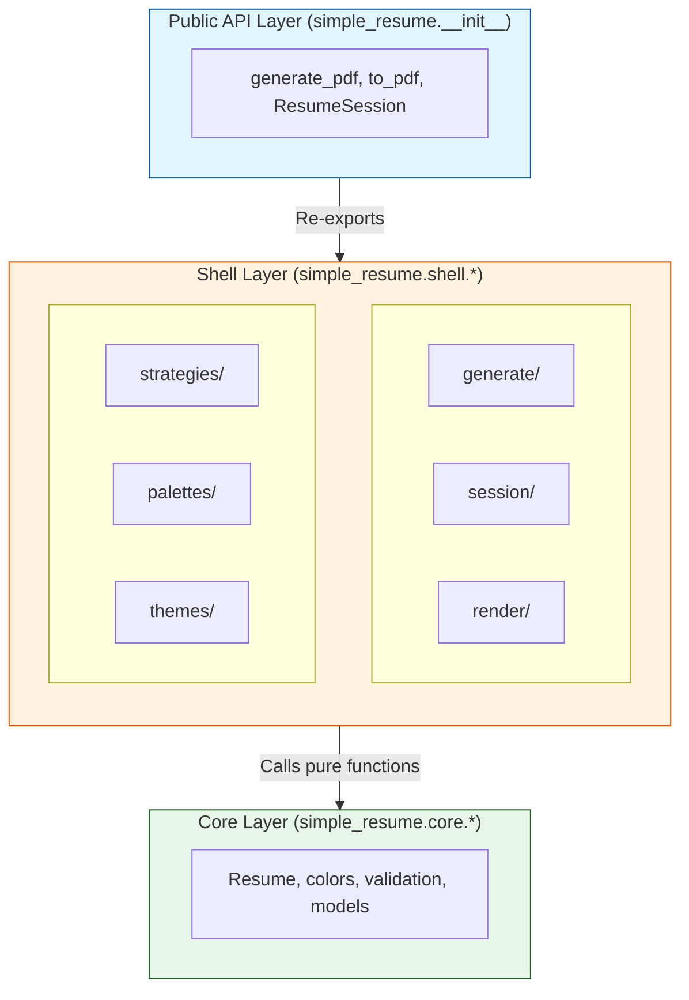

# Shell Layer API Documentation

**Status:** Internal Reference
**Last Updated:** 2025-01-03
**Related:** [API Stability Policy](API-Stability-Policy.md)

---

## Overview

The shell layer (`simple_resume.shell.*`) contains I/O operations, side effects, and orchestration logic. While some shell functions are re-exported in the public API, most shell modules are **internal** and may change without notice.

**Key Principle:** The shell layer depends on the core layer, never the reverse.

---

## Architecture Diagram



---

## Module Reference

### ✅ Stable Re-Exports

These shell functions are re-exported in `simple_resume.__all__` and are **stable**:

| Function | Source Module | Stability |
|----------|---------------|-----------|
| `to_pdf` | `shell.resume_extensions` | ✅ Stable |
| `to_html` | `shell.resume_extensions` | ✅ Stable |
| `generate` | `shell.resume_extensions` | ✅ Stable |
| `preview` | `shell.generate.lazy` | ✅ Stable |
| `generate_pdf` | `shell.generate.lazy` | ✅ Stable |
| `generate_html` | `shell.generate.lazy` | ✅ Stable |
| `generate_all` | `shell.generate.lazy` | ✅ Stable |
| `generate_resume` | `shell.generate.lazy` | ✅ Stable |
| `ResumeSession` | `shell.session.manage` | ✅ Stable |
| `SessionConfig` | `shell.session.config` | ✅ Stable |
| `create_session` | `shell.session.manage` | ✅ Stable |

---

### ⚠️ Internal Shell Modules

The following modules are **internal** and may change:

#### `shell.resume_extensions`

**Purpose:** I/O operations for Resume objects

**Stable Functions (re-exported):**
- `to_pdf(resume, output_path, *, open_after, strategy)` - Generate PDF
- `to_html(resume, output_path, *, open_after, browser)` - Generate HTML
- `to_markdown(resume, output_path, *, open_after)` - Generate Markdown
- `to_tex(resume, output_path, *, open_after)` - Generate LaTeX
- `render_markdown_file(input_path, output_path, *, open_after)` - Render MD→HTML
- `render_tex_file(input_path, output_path, *, open_after)` - Render TeX→PDF
- `generate(resume, format_type, output_path, *, open_after)` - Format dispatcher

**Internal Functions (may change):**
- `_generate_markdown_from_context(context, resume_name)` - Internal MD generation

**Usage:**
```python
# ✅ Recommended: Import from public API
from simple_resume import to_pdf, to_html

# ⚠️ Not recommended: Direct import (may break)
from simple_resume.shell.resume_extensions import to_pdf
```

#### `shell.generate`

**Purpose:** High-level generation functions with lazy loading

**Stable Functions (re-exported via lazy.py):**
- `generate_pdf(config, **config_overrides)` - Lazy-loaded PDF generation
- `generate_html(config, **config_overrides)` - Lazy-loaded HTML generation
- `generate_all(config, **config_overrides)` - Lazy-loaded multi-format
- `generate_resume(config, **config_overrides)` - Lazy-loaded single resume
- `generate(source, options, **overrides)` - Lazy-loaded convenience wrapper
- `preview(source, *, data_dir, template, browser, open_after)` - Lazy-loaded preview

**Internal Modules:**
- `shell.generate.lazy` - Lazy loading wrapper (internal implementation)
- `shell.generate.core` - Core generation logic (internal implementation)

**Usage:**
```python
# ✅ Recommended: Import from public API
from simple_resume import generate_pdf, generate

# ⚠️ Not recommended: Direct import (may break)
from simple_resume.shell.generate import generate_pdf
from simple_resume.shell.generate.lazy import generate
```

#### `shell.session`

**Purpose:** Batch operations with shared configuration

**Stable Classes/Functions (re-exported):**
- `SessionConfig` - Configuration for ResumeSession (dataclass)
- `ResumeSession` - Context manager for batch operations
- `create_session(data_dir, **kwargs)` - Factory function

**Stable Methods (ResumeSession):**
- `resume(name)` - Load a resume by name
- `generate_all(format, **kwargs)` - Generate all resumes
- `generate_resume(resume, format, **kwargs)` - Generate single resume

**Internal Implementation:**
- `shell.session.manage` - Internal session management logic
- `shell.session.config` - Internal configuration handling

**Usage:**
```python
# ✅ Recommended: Import from public API
from simple_resume import ResumeSession, SessionConfig

# ⚠️ Not recommended: Direct import (may break)
from simple_resume.shell.session.manage import ResumeSession
```

#### `shell.render`

**Purpose:** Template rendering operations

**Stable Functions (re-exported via resume_extensions):**
- Indirect access through `to_pdf`, `to_html`

**Internal Functions:**
- `generate_html_with_jinja(render_plan, output_path, filename)` - Jinja2 rendering
- `render_resume_latex_from_data(data, paths, template_name)` - LaTeX rendering

**Dependencies:**
- `weasyprint` - HTML→PDF conversion
- `jinja2` - Template engine
- `markdown` - Markdown processing

**Usage:**
```python
# ✅ Recommended: Use high-level API
from simple_resume import to_html

# ⚠️ Advanced: Direct rendering (internal)
from simple_resume.shell.render.operations import generate_html_with_jinja
```

#### `shell.palettes`

**Purpose:** Color palette management and remote fetching

**Internal Modules:**
- `shell.palettes.loader` - Load palettes from files/defaults
- `shell.palettes.remote` - Fetch palettes from remote sources
- `shell.palettes.fetch` - Coordinate palette fetching

**Internal Classes:**
- `ColourLoversClient` - Fetch palettes from ColourLovers API

**Usage:**
```python
# ✅ Recommended: Use configuration-based palette loading
from simple_resume import Resume
resume = Resume.read_yaml("resume.yaml").with_palette("Professional Blue")

# ⚠️ Advanced: Direct palette operations (internal)
from simple_resume.shell.palettes.loader import load_palette
palette = load_palette("Professional Blue")
```

#### `shell.themes`

**Purpose:** Template discovery and loading

**Internal Modules:**
- `shell.themes.loader` - Template loader

**Internal Functions:**
- `discover_templates(paths)` - Find available templates
- `load_template(name, paths)` - Load template by name

**Usage:**
```python
# ✅ Recommended: Use Resume.with_template()
from simple_resume import Resume
resume = Resume.read_yaml("resume.yaml").with_template("resume_no_bars")

# ⚠️ Advanced: Direct template operations (internal)
from simple_resume.shell.themes.loader import discover_templates
templates = discover_templates(paths)
```

#### `shell.strategies`

**Purpose:** PDF generation strategy pattern

**Stable Protocol:**
- `PdfGenerationStrategy` - Protocol for custom PDF strategies (core.protocols)

**Internal Classes:**
- `PdfGenerationRequest` - Request dataclass for PDF generation
- `DefaultPdfGenerationStrategy` - Default WeasyPrint-based strategy

**Usage:**
```python
# ✅ Recommended: Use protocol for extensions
from simple_resume.core.protocols import PdfGenerationStrategy

class CustomPdfStrategy(PdfGenerationStrategy):
    def generate(self, render_plan, output_path, resume_name, filename):
        # Custom implementation
        pass
```

#### `shell.services`

**Purpose:** Service locator and dependency injection

**Internal Functions:**
- `register_default_services()` - Register default implementations
- `DefaultPdfGenerationStrategy` - Default strategy factory

**Usage:**
```python
# ⚠️ Internal: Service registration (usually automatic)
from simple_resume.shell.services import register_default_services
register_default_services()
```

#### `shell.runtime`

**Purpose:** Runtime utilities and lazy loading

**Internal Modules:**
- `shell.runtime.lazy_import` - Lazy loading utilities
- `shell.runtime.generate` - Execution engine for generation commands
- `shell.runtime.content` - Content rendering utilities

**Internal Classes:**
- `_LazyCoreLoader` - Lazy loader for core functions
- `FileOpener` - Cross-platform file opening

**Usage:**
```python
# ✅ Recommended: Use public API (lazy loading is automatic)
from simple_resume import generate_pdf

# ⚠️ Internal: Direct lazy loader access
from simple_resume.shell.generate.lazy import _get_lazy_core_loader
loader = _get_lazy_core_loader()
```

#### `shell.config`

**Purpose:** Configuration resolution and path management

**Internal Functions:**
- `resolve_paths(data_dir, input_dir, output_dir)` - Resolve project paths
- `get_default_paths()` - Get default directory structure

**Usage:**
```python
# ✅ Recommended: Let ResumeSession handle paths
from simple_resume import ResumeSession
with ResumeSession(data_dir="resume_private") as session:
    # Paths resolved automatically
    pass

# ⚠️ Advanced: Manual path resolution (internal)
from simple_resume.shell.config import resolve_paths
paths = resolve_paths(data_dir="resume_private")
```

#### `shell.cli`

**Purpose:** Command-line interface

**Internal Modules:**
- `shell.cli.main` - CLI entry point and argument parsing
- `shell.cli.palette` - Palette utility commands
- `shell.cli.random_palette_demo` - Demo tool

**Internal Functions:**
- `main()` - CLI entry point
- `create_parser()` - Argument parser
- `handle_generate_command(args)` - Generate subcommand handler
- `handle_session_command(args)` - Session subcommand handler
- `handle_validate_command(args)` - Validate subcommand handler

**Usage:**
```bash
# ✅ Recommended: Use CLI commands
simple-resume generate --format pdf
simple-resume session
simple-resume validate
```

---

## Extension Patterns

While most shell modules are internal, you can extend functionality through stable protocols:

### Custom PDF Generation Strategy

```python
from simple_resume.core.protocols import PdfGenerationStrategy
from simple_resume.shell.resume_extensions import to_pdf

class LatexStrategy(PdfGenerationStrategy):
    """Custom LaTeX-based PDF generation."""

    def generate(
        self,
        render_plan,
        output_path,
        resume_name,
        filename,
    ):
        # Custom LaTeX compilation logic
        pass

# Use custom strategy
from simple_resume import Resume
resume = Resume.read_yaml("resume.yaml")
result = to_pdf(resume, strategy=LatexStrategy())
```

### Custom Template Directory

```python
from simple_resume import Resume

# Specify custom template location
resume = Resume.read_yaml(
    "custom_resume.yaml",
    template_path="/path/to/templates"  # Advanced parameter
)
```

---

## Best Practices

### ✅ Do

- Import from `simple_resume` public API
- Use `ResumeSession` for batch operations
- Extend through protocols (`PdfGenerationStrategy`)
- Report breaking changes via issues

### ❌ Don't

- Import directly from `simple_resume.shell.*` unless extending
- Depend on internal function signatures
- Access private attributes (prefixed with `_`)
- Assume shell module structure won't change

---

## Migration Guide

### If You're Using Internal APIs

**Before (v0.1.6):**
```python
from simple_resume.shell.generate.core import generate_pdf
result = generate_pdf(config)
```

**After (v0.1.7+):**
```python
from simple_resume import generate_pdf
result = generate_pdf(config)
```

### If You're Extending Functionality

**Use Stable Protocols:**
```python
# ✅ Good: Extend via protocol
from simple_resume.core.protocols import PdfGenerationStrategy

class MyStrategy(PdfGenerationStrategy):
    def generate(self, ...):
        pass

# ❌ Avoid: Internal implementation details
from simple_resume.shell.strategies import DefaultPdfGenerationStrategy
class MyStrategy(DefaultPdfGenerationStrategy):  # May break
    pass
```

---

## Related Documentation

- [API Reference](API-Reference.md) - Complete public API documentation
- [API Stability Policy](API-Stability-Policy.md) - Stability guarantees
- [Architecture Guide](Architecture-Guide.md) - FCIS architecture details
- [ADR-002: Functional Core, Imperative Shell](architecture/ADR002-functional-core-imperative-shell.md) - Design rationale
